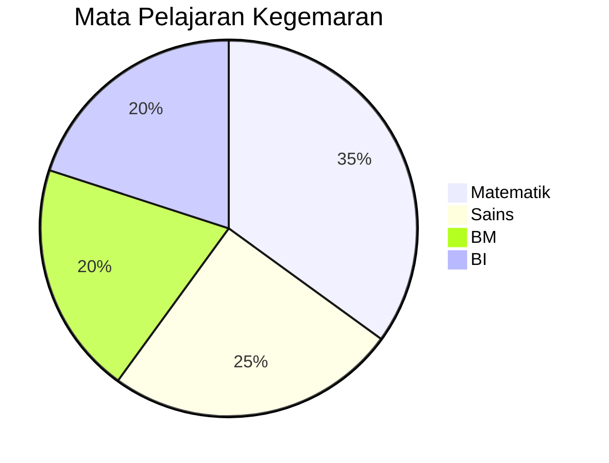
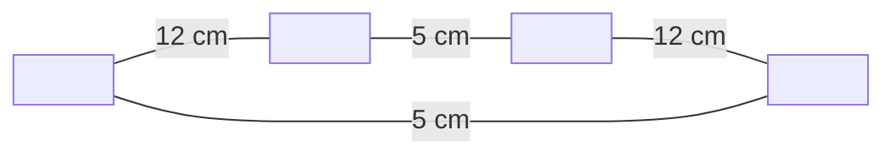
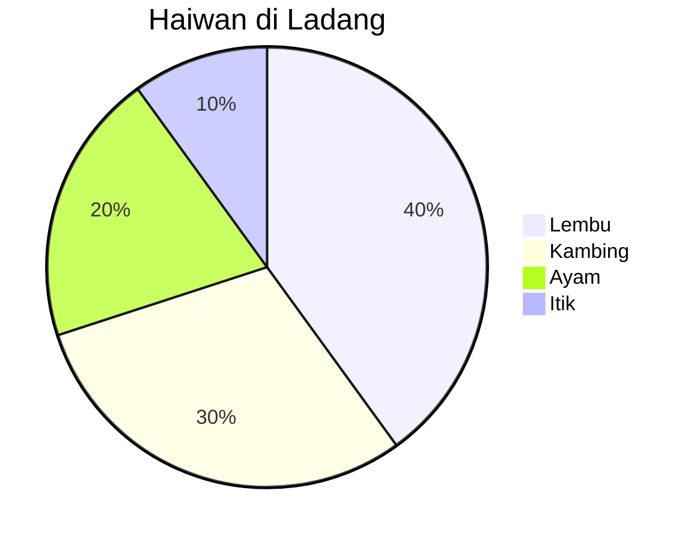

## Bahagian A: Pilihan Berganda
*Pilih satu jawapan yang betul.*

---

**S1.** Berapakah nilai digit **4** dalam nombor **34 761**?

[mcq:S1]
- A. 4
- B. 40
- C. 400
- D. 4 000

---

**S2.** Rajah di bawah menunjukkan taburan mata pelajaran kegemaran murid-murid Tahun 4.

Berapakah peratus murid yang gemar Matematik?

[mcq:S2]
- A. 20%
- B. 25%
- C. 35%
- D. 40%

---

**S3.** Sebuah kedai menjual **1 248** biji telur pada hari Isnin dan **976** biji telur pada hari Selasa. Berapakah jumlah telur yang dijual dalam dua hari itu?

[mcq:S3]
- A. 2 124
- B. 2 214
- C. 2 224
- D. 2 244

---

**S4.** Antara pecahan berikut, yang manakah **paling besar**?

[mcq:S4]
- A. 1/2
- B. 3/8
- C. 2/3
- D. 5/12

---

**S5.** Rajah di bawah menunjukkan waktu Aina tiba di sekolah dan waktu dia pulang.

```mermaid
gantt
  title Jadual Aina di Sekolah
  dateFormat HH:mm
  axisFormat %H:%M
  section Masa
  Di sekolah : 07:30, 13:30
```

Berapakah tempoh masa Aina berada di sekolah?

[mcq:S5]
- A. 5 jam
- B. 5 jam 30 minit
- C. 6 jam
- D. 6 jam 30 minit

---

**S6.** Harga sebiji epal ialah **RM 1.50**. Puan Siti membeli **8** biji epal. Berapakah jumlah wang yang dibayar oleh Puan Siti?

[mcq:S6]
- A. RM 9.50
- B. RM 10.00
- C. RM 11.50
- D. RM 12.00

---

**S7.** Rajah berikut menunjukkan sebuah segi empat tepat.

Berapakah perimeter segi empat tepat itu?

[mcq:S7]
- A. 17 cm
- B. 24 cm
- C. 34 cm
- D. 60 cm

---

**S8.** **4.65 + 2.8 =**

[mcq:S8]
- A. 6.45
- B. 7.45
- C. 7.53
- D. 8.45

---

**S9.** Sebuah bekas mengandungi **3/4 liter** air. Bekas itu kemudiannya diisi lagi sebanyak **1/4 liter**. Berapakah isipadu air dalam bekas itu sekarang?

[mcq:S9]
- A. 2/4 liter
- B. 3/8 liter
- C. 1 liter
- D. 1 1/4 liter

---

**S10.** Rajah di bawah menunjukkan taburan jenis haiwan dalam sebuah ladang.

Jika terdapat **200** ekor haiwan di ladang itu, berapakah bilangan kambing?

[mcq:S10]
- A. 30
- B. 40
- C. 60
- D. 80

---

## Bahagian B: Isian Tempat Kosong
*Isi tempat kosong dengan jawapan yang betul.*

---

**S11.** **27 × 8 =**

[fill:S11]

---

**S12.** Tukarkan kepada perpuluhan: **3/4 =**

[fill:S12]

---

**S13.** **5 008 − 2 349 =**

[fill:S13]

---

**S14.** Sebuah segi tiga mempunyai tapak **10 cm** dan tinggi **6 cm**. Luas segi tiga itu ialah ______ cm².

[fill:S14]

---

**S15.** **0.6 × 5 =**

[fill:S15]

---

## Bahagian C: Jawapan Pendek
*Tunjukkan jalan kerja dan tulis jawapan dengan lengkap.*

---

**S16.** Sebuah balang mengandungi **480** biji gula-gula. Gula-gula itu dibahagikan sama rata kepada **12** orang kanak-kanak. Berapakah bilangan gula-gula yang diterima oleh setiap kanak-kanak?

[short:S16]

---

**S17.** Harga sehelai baju ialah **RM 45.90**. Encik Razif membeli **3** helai baju yang sama. Dia membayar dengan **RM 200.00**. Berapakah baki wang yang diterima oleh Encik Razif?

[short:S17]

---

**S18.** Jadual di bawah menunjukkan bilangan buku yang dijual oleh sebuah kedai buku dalam 3 hari.

| Hari | Bilangan Buku |
|---|---|
| Isnin | 145 |
| Selasa | 238 |
| Rabu | 197 |

Berapakah purata bilangan buku yang dijual sehari?

[short:S18]

---

**S19.** Pak Ali mempunyai sebidang tanah berbentuk segi empat tepat dengan panjang **15 meter** dan lebar **8 meter**. Dia ingin memagari seluruh kawasan tanah tersebut. Harga pagar ialah **RM 12.00** sesatu meter.

(a) Hitungkan perimeter tanah Pak Ali.

(b) Hitungkan jumlah kos pemagaran tanah Pak Ali.

[essay:S19]